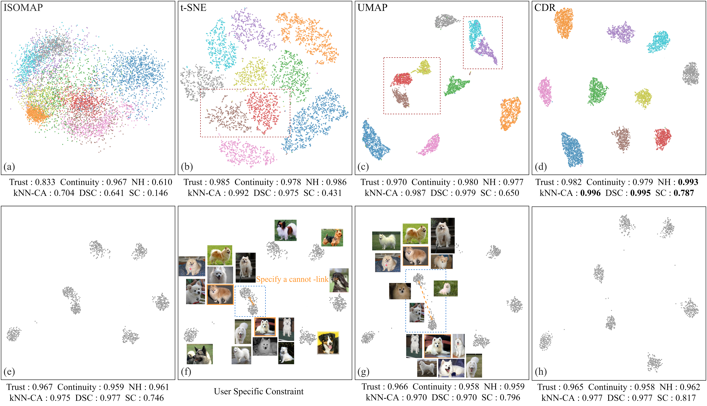

# CDR - Interactive Visual Cluster Analysis by Contrastive Dimensionality Reduction



## Environment setup

This project was based on `python 3.6 and pytorch 1.6.0`. See `requirements.txt` for all prerequisites, and you can also install them using the following command.

```bash
pip install -r requirements.txt
```

## Datasets

|               | Size  | Dimensionality | Clusters |  Type   |                             Link                             |
| :-----------: | :---: | :------------: | :------: | :-----: | :----------------------------------------------------------: |
|    Animals    | 10000 |      512       |    10    |  image  | [Kaggle](https://www.kaggle.com/datasets/alessiocorrado99/animals10) |
| Anuran calls  | 7195  |       22       |    8     | tabular | [UCI](https://archive.ics.uci.edu/ml/datasets/Anuran+Calls+%28MFCCs%29) |
|   Banknote    | 1097  |       4        |    2     |  text   | [UCI](https://archive.ics.uci.edu/ml/datasets/banknote+authentication) |
|    Cifar10    | 10000 |      512       |    10    |  image  | [Alex Krizhevsky](https://www.cs.toronto.edu/~kriz/cifar.html) |
|     Cnae9     |  864  |      856       |    9     |  text   |    [UCI](https://archive.ics.uci.edu/ml/datasets/cnae-9)     |
| Cats-vs-Dogs  | 10000 |      512       |    2     |  image  | [Kaggle](https://www.kaggle.com/datasets/shaunthesheep/microsoft-catsvsdogs-dataset) |
|     Fish      | 9000  |      512       |    9     |  image  | [Kaggle](https://www.kaggle.com/datasets/crowww/a-large-scale-fish-dataset) |
|     Food      | 3585  |      512       |    11    |  image  | [Kaggle](https://www.kaggle.com/datasets/anshulmehtakaggl/themassiveindianfooddataset) |
|      Har      | 8240  |      561       |    6     | tabular | [UCI](https://archive.ics.uci.edu/ml/datasets/human+activity+recognition+using+smartphones) |
|    Isolet     | 1920  |      617       |    8     |  text   |    [UCI](https://archive.ics.uci.edu/ml/datasets/isolet)     |
|   ML binary   | 1000  |       10       |    2     | tabular | [Kaggle](https://www.kaggle.com/datasets/rhythmcam/ml-binary-classification-study-data) |
|     MNIST     | 10000 |      784       |    10    |  image  |       [Yann LeCun](http://yann.lecun.com/exdb/mnist/)        |
|   Pendigits   | 8794  |       16       |    10    | tabular | [UCI](https://archive.ics.uci.edu/ml/datasets/pen-based+recognition+of+handwritten+digits) |
|    Retina     | 10000 |       50       |    12    | tabular | [Paper](https://www.cell.com/fulltext/S0092-8674(15)00549-8) |
|   Satimage    | 5148  |       36       |    6     |  image  | [UCI](https://archive.ics.uci.edu/ml/datasets/Statlog+(Landsat+Satellite)) |
| Stanford Dogs | 1384  |      512       |    7     |  image  | [Stanford University](http://vision.stanford.edu/aditya86/ImageNetDogs/) |
|    Texture    | 4400  |       40       |    11    |  text   |     [KEEL](https://sci2s.ugr.es/keel/dataset.php?cod=72)     |
|     USPS      | 7440  |      256       |    10    |  image  |  [Kaggle](https://www.kaggle.com/bistaumanga/usps-dataset)   |
|   Weathers    |  900  |      512       |    4     |  image  | [Kaggle](https://www.kaggle.com/datasets/vijaygiitk/multiclass-weather-dataset) |
|     WiFi      | 1600  |       7        |    4     | tabular | [UCI](https://archive.ics.uci.edu/ml/datasets/Wireless+Indoor+Localization) |

For image dataset such as Animals, Cifar10, Cats-vs-Dogs, Fish, Food, Stanford Dogs and Weathers, we use [SimCLR](https://github.com/sthalles/SimCLR) to get their 512 dimensional representations. 

All the datasets are supported with **H5 format** (e.g. usps.h5), and we need all the dataset to be stored at **`data/H5 Data`.** For image data sets, place all images as `0.jpg,1.jpg,...,n-1.jpg` format and put it in the `static/images/(dataset name)`(e.g. static/images/usps) directory.

## Pre-trained model weights

The pre-training model weights on all the above data sets can be found in [Google Drive](https://drive.google.com/drive/folders/19WYgUcOI6cOYSUPK_w1eICSr0ceRK9Zb?usp=sharing).

## Training

To train the model on USPS with a single GPU, check the configuration file `configs/CDR.yaml`， and try the following command:

```bash
python train.py --configs configs/CDR.yaml
```

## Config File

The configuration files can be found under the folder `./configs`, and we provide two config files with the format `.yaml`. We give the guidance of several key parameters in this paper below.

- **n_neighbors(K):** It determines **the granularity of the local structure** to be maintained in low-dimensional space. A too small value will cause one cluster in the high-dimensional space be projected into two low-dimensional clusters, while too large value will aggravate the problem of clustering overlap. The default setting is **K = 15**.
- **batch_size(B):** It determines the number of negative samples. A larger value is better, but it also depends on the data size. We recommend to use **`B = n/10`**, where `n` is the number of instances.
- **temperature(t):** It determines the ability of the model upon neighborhood preservation. The smaller the value is, the more strict the model is to maintain the neighborhood, but it also keeps more error neighbors. The default setting  is **t = 0.15**.
- **separate_upper(μ):** It determines the intensity of cluster separation. The larger the value is, the higher the cluster separation degree is.  The default setting  is **μ = 0.11**.

## Load pre-trained model for visualization

To use our pre-trained model, try the following command:

```bash
# python vis.py --configs 'configuration file path' --ckpt 'model weights path'

# Example on USPS dataset
python vis.py --configs configs/CDR.yaml --ckpt_path model_weights/usps.pth.tar
```

## Prototype interface

Using our prototype interface for interactive visual clustering analysis, try the following command.

```bash
python app.py --config configs/ICDR.yaml
```

After that, the prototype interface can be found in [http://127.0.0.1:5000](http://127.0.0.1:5000) .


[comment]: <> "## Cite"

